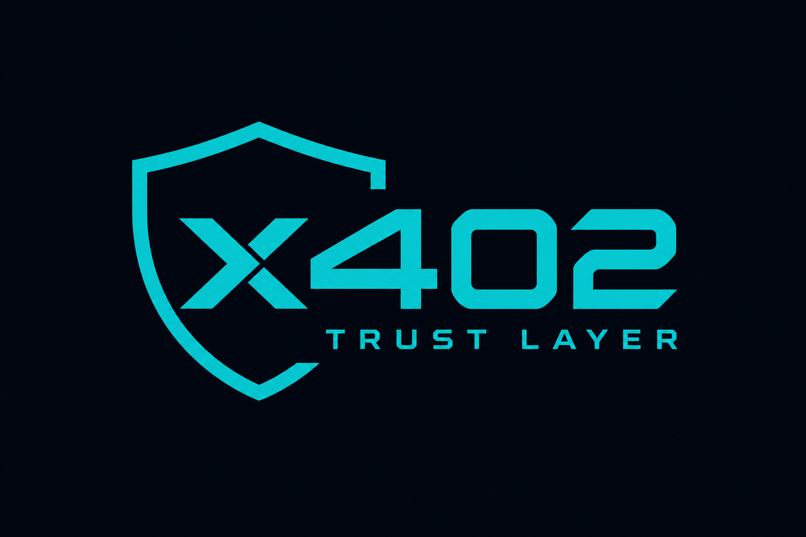

<p align="center">
  
</p>

<h1 align="center">x402 Trust Layer</h1>

<p align="center"><strong>The trust layer for agent payments.</strong><br/>
<code>x402trustlayer.xyz</code> · Guard · Attest · Comply · Audit</p>

<p align="center">
<a href="https://x402trustlayer.xyz"></a>
<a href="https://x402gle.com/servers/x402-agent-suite-production.up.railway.app"></a>
<a href="https://dexter.cash/sellers/9c7tE587KpGYBjiNQrjw3nGvxQHhSYKU4Ba6WRgQsHkt"></a>
<a href="https://www.x402scan.com"></a>
</p>

---

> **x402 Trust Layer** *(x402 Agent Suite Pro)* — 31 paid x402 APIs for guard,
> attestation, compliance and settlement. Live at **https://x402trustlayer.xyz**

A control plane for autonomous agent commerce. Thirty-one paid x402 APIs that an
AI agent calls *before, during, and after* it spends money — to decide whether a
merchant is trustworthy, whether a payment is allowed, which rail is cheapest, and
whether the response it paid for was actually worth it. Everything settles in USDC
over the [Dexter facilitator](https://x402.dexter.cash), on Base or Solana, for a
few cents a call.

**Live:** https://x402trustlayer.xyz *


### The four layers

| | Layer | Does | Key endpoints |
|---|-------|------|---------------|
| **01** | **Guard** | Preflight spend / identity / risk before any payment | `/guard/pre-x402` · `/x402/proxy` |
| **02** | **Attestation** | Issue, verify & register agent credentials and mandates | `/attestation/*` · `/mandate/*` |
| **03** | **Compliance** | Ledgers, evidence bundles, disputes, refunds | `/compliance/ledger` · `/dispute/resolve` · `/refund-arbiter` |
| **04** | **Settlement Ops** | Rail routing, MPP sessions, escrow, receipt audit | `/rail-optimizer` · `/mpp/session` · `/receipt-auditor` |

---

## Why this exists

The agentic-payments stack has matured fast — Visa shipped a CLI that lets agents
pay over card rails, Stripe has MPP on Tempo, Google published AP2, and Coinbase's
x402 turned any HTTP 402 into a settlement instruction. What's missing is the
*judgement layer*. An agent can now pay anyone, instantly, with no human in the loop.
That's exactly the problem.

This suite is the missing judgement layer. It answers the questions a careful
finance team would ask on the agent's behalf, in the milliseconds before money moves:

- *Is this merchant real, or is it a wash-traded shell I should avoid?*
- *Is this payment inside the mandate the human actually authorized?*
- *Base, Solana, Visa, or Stripe — which rail is cheapest and most disputable here?*
- *Did I get the data I paid for, or should this be refunded?*
- *Can I hand my CFO a clean, signed, tax-ready record of everything the fleet spent?*

Each answer is its own endpoint, priced per call, and composable into a single
guarded pipeline.

---

## Proof it works

This isn't a mock. As of the last release every route was exercised with **real,
on-chain USDC settlement on Base**, and the whole origin is indexed on x402scan:

- **x402scan** — registered via OpenAPI discovery, `31/31` resources accepted, `0` failed.
- **Live paid pass** — all 31 endpoints returned `200` with a verified settlement transaction.
- **x402gle auditions** (live, paid, response-scored):
  - `POST /api/pipeline/execute` → **93** · [audition](https://x402gle.com/audition/04540084-c255-44fd-957a-1487eafaa23d)
  - `POST /api/mpp/session-plan` → **86** · [audition](https://x402gle.com/audition/4e16c507-5c6e-4b9e-96e2-a1cba9732a55)
  - `POST /api/quality-monitor/probe` → **82** · [audition](https://x402gle.com/audition/fbad6aad-d2f8-4ccb-9684-3f6474c03784)

Want to run the pass yourself? See **[docs/TESTING.md](docs/TESTING.md)** — it has a
ready-to-send request body for every single endpoint.

---

## The three things most agents need

You rarely need all 31 routes at once. For the common case, reach for one of these:

| Endpoint | Price | Use it when |
|----------|-------|-------------|
| `POST /api/x402/proxy` | **$0.08** | Default preflight before any external `x402_fetch` — policy + risk + attestation in one call |
| `POST /api/guard/pre-x402` | **$0.05** | Same policy bundle, no downstream probe |
| `POST /api/pipeline/execute` | **$0.25** | Full orchestration: pick a marketplace API, guard it, route the payment, return a plan |

Spend-governor, identity-gate, and risk-gate run *inside* guard and proxy. Call them
on their own only when you're debugging a specific decision.

```typescript
// The 3-line integration most fleets ship
const pre = await x402Fetch(`${BASE}/api/x402/proxy`, {
  method: "POST",
  body: JSON.stringify({ agentId, walletAddress, targetUrl, estimatedCostUsdc: 0.05, policy }),
});
if (!(await pre.json()).allowed) throw new Error("blocked by policy");
// → now x402_check / x402_fetch the target, then POST /api/receipt-auditor/verify
```

---

## The full catalog — all 31 agents

Full reference (inputs, outputs, internal logic, example calls) lives in
**[docs/AGENT-CATALOG.md](docs/AGENT-CATALOG.md)**. The short version:

### Tier-1 — enterprise control plane

The newest layer, built for the Visa CLI / AP2 era: trust, verifiable intent,
cross-rail routing, compliance, disputes, and quality-gated settlement.

| Endpoint | Price | What it does |
|----------|-------|--------------|
| `POST /api/merchant-trust/score` | $0.06 | Know-Your-Merchant score: wash-trading, verified ratio, latency, live probe → pay / caution / avoid |
| `POST /api/mandate/compile` | $0.08 | Turns a human intent into a signed, scoped AP2-style payment mandate |
| `POST /api/mandate/verify` | $0.02 | Checks a proposed payment against a mandate's signature and scope |
| `POST /api/rail-optimizer/route` | $0.04 | Picks the cheapest, most disputable rail across Visa CLI / Stripe MPP / Circle / Base / Solana |
| `POST /api/compliance/ledger` | $0.12 | CFO/SOC2-grade spend reconciliation with policy-violation flags |
| `POST /api/dispute/resolve` | $0.10 | Builds a Visa chargeback dossier or an on-chain refund claim |
| `POST /api/quality-escrow/settle` | $0.10 | Holds payment in escrow, releases only if the response clears a quality bar |

### Entry points & orchestration

| Endpoint | Price | What it does |
|----------|-------|--------------|
| `POST /api/x402/proxy` | $0.08 | One-call preflight: policy + risk + optional probe + attestation |
| `POST /api/guard/pre-x402` | $0.05 | Combined spend / identity / risk gate |
| `POST /api/pipeline/execute` | $0.25 | Marketplace pick → guard → route → execution plan |
| `POST /api/payment-intent/compile` | $0.15 | Compiles a natural-language task into a budgeted payment intent |
| `POST /api/facilitator/failover` | $0.05 | Health-checks facilitators and picks a live one |
| `POST /api/mpp/session-plan` | $0.02 | Estimates the cost/shape of a Stripe-MPP-style metered session |

### Core gates & utilities

| Endpoint | Price | What it does |
|----------|-------|--------------|
| `POST /api/spend-governor/check` | $0.03 | Per-call and daily cap enforcement |
| `POST /api/identity-gate/check` | $0.05 | Wallet tier / network checks before spending |
| `POST /api/risk-gate/scan` | $0.08 | Target-URL and price sanity scan |
| `POST /api/router/route` | $0.02 | Finds the best marketplace API for a query |
| `POST /api/research/brief` | $0.20 | Quick grounded brief, optionally with price data |
| `POST /api/receipt-auditor/verify` | $0.05 | Verifies a settlement receipt against the expected amount/network |

### MPP, attestation, trust & enterprise

| Endpoint | Price | What it does |
|----------|-------|--------------|
| `POST /api/mpp/session` | $0.03 | Open / close a metered payment session |
| `POST /api/attestation/issue` | $0.04 | Issues a signed attestation that a payment passed policy |
| `POST /api/attestation/verify` | $0.02 | Verifies an attestation by id |
| `GET  /api/attestation/registry` | $0.02 | Queries the trust registry of valid attestations |
| `POST /api/refund-arbiter/evaluate` | $0.08 | Decides whether a weak response merits a refund |
| `POST /api/settlement-graph/next` | $0.02 | Suggests the next logical endpoint in a workflow |
| `POST /api/quality-monitor/probe` | $0.03 | Probes a set of URLs for liveness and response quality |
| `POST /api/budget-allocator/run` | $0.03 | Allocates a shared pool across a fleet by priority |
| `POST /api/evidence-locker/export` | $0.10 | Exports an immutable evidence bundle of spend records |
| `POST /api/agent-escrow` | $0.12 | Create / release agent-to-agent escrow |

### Seller / buyer tooling

| Endpoint | Price | What it does |
|----------|-------|--------------|
| `POST /api/market/buy-advisor` | $0.08 | Ranks marketplace APIs before you pay |
| `POST /api/seller/audition-coach` | $0.06 | Flags OpenAPI/402 problems before a Dexter audition |

Every paid response carries a **trust envelope** — `confidence`, `checks_passed`,
`sources`, and an `accuracy_note` — so the calling agent can reason about how much
to rely on the answer.

---

## How to test it

Three levels, from free to fully paid. The complete walkthrough with a request body
for every endpoint is in **[docs/TESTING.md](docs/TESTING.md)**.

```bash
BASE=https://x402-agent-suite-production.up.railway.app

# 1) Free — confirm everything is alive and paywalled
npm run probe:production
curl -i -X POST $BASE/api/merchant-trust/score          # expect HTTP 402

# 2) One paid call (any x402 client / OpenDexter x402_fetch)
#    point it at an endpoint, set a per-call cap, send the example body

# 3) Full paid pass — all 31 routes, ~$2.30 USDC on Base
npm run demo
```

Paid calls need a wallet with a little USDC. Most endpoints cost $0.02–$0.12;
`pipeline/execute` is the priciest at $0.25. Always set a per-call cap.

---

## Discovery surfaces

| URL | Purpose |
|-----|---------|
| `GET /openapi.json` | Canonical contract (x402scan / AgentCash read this first) |
| `GET /.well-known/x402` | 31 payable resource URLs |
| `GET /x402/api/services.json` | Bazaar manifest |
| `GET /api/agents` | Live route list with prices and tiers |

Re-register on x402scan any time with `node scripts/register-x402scan.mjs`
(or the [Add API](https://www.x402scan.com/resources/register) form). Don't register
`/health` — it isn't payable.

---

## Run it locally

```bash
git clone https://github.com/mimranchohan/x402-agent-suite.git
cd x402-agent-suite
cp .env.example .env
npm install
npm run dev
```

Multi-chain config (Base-first, Solana enabled):

```env
NETWORKS=base,solana
PAY_TO_EVM=0xYourEvmWallet
PAY_TO_ADDRESS=YourSolanaWallet
FACILITATOR_URL=https://x402.dexter.cash
```

---

## Docs

| Doc | Topic |
|-----|-------|
| [AGENT-CATALOG.md](docs/AGENT-CATALOG.md) | Full reference for all 31 agents — logic, schemas, examples |
| [TESTING.md](docs/TESTING.md) | How to test every endpoint, with ready-to-send bodies |
| [ARCHITECTURE.md](docs/ARCHITECTURE.md) | System design and request lifecycle |
| [INTEGRATE.md](docs/INTEGRATE.md) | Fleet flow, attestation, the 3-line rule |
| [MARKETPLACES.md](docs/MARKETPLACES.md) | Dexter + x402scan + Agentic listing checklist |
| [DEXTER-SCORE.md](docs/DEXTER-SCORE.md) | Hitting a 75+ verification score |

---

MIT © mimranchohan
