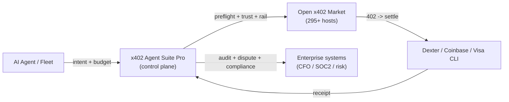
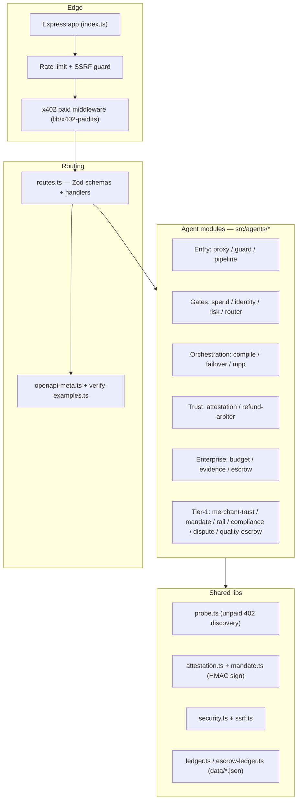
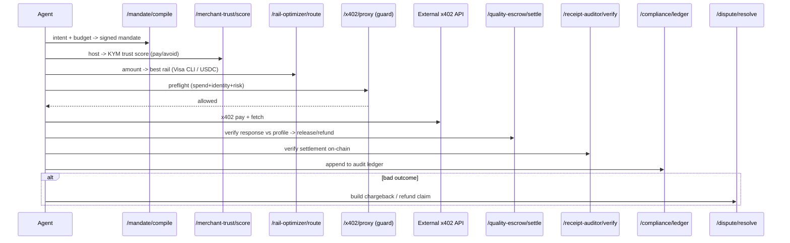
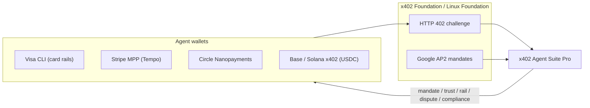

# x402 Agent Suite Pro — Enterprise Agent Catalog

> Complete reference for all **38 paid x402 infrastructure agents** in this repo. For every agent: what it does, why it matters, how it works internally, endpoint + price, request/response schema, and an example call.

- **Live:** https://x402trustlayer.xyz
- **Settlement:** USDC via the [Dexter facilitator](https://x402.dexter.cash), multi-chain (Base + Solana, Polygon-aware)
- **Discovery:** `GET /openapi.json`, `GET /.well-known/x402`, `GET /x402/api/services.json`

---

## 1. What this suite is

AI agents can now pay for APIs autonomously (Coinbase x402, Visa CLI, Stripe MPP). The hard part is no longer *paying* — it is paying **safely, within policy, with proof, and with recourse**. This suite is the **control plane** that sits between an agent and the open x402 marketplace: it decides *whether* to pay, *which rail* to pay on, *whom* to trust, and *what* to do when a payment goes wrong.



---

## 2. System architecture



**Design principles** (inherited from [ARCHITECTURE.md](./ARCHITECTURE.md)):
- **Paywall-first** — no business logic runs on unpaid `/api/*` (except canonical verifier example bodies for marketplace probes).
- **Composable agents** — bundles (`pre-x402-guard`, `x402-proxy`, `pipeline/execute`) reuse the same sub-agents; pay once per layer.
- **Tamper-evident** — HMAC-signed attestations and mandates, SHA-256 ledger hashes.
- **Pluggable persistence** — JSON under `data/`; swap for Postgres at fleet scale.

---

## 3. End-to-end enterprise pipeline

A full "safe autonomous purchase" with the new Tier-1 agents woven in:



---

## 4. Pricing & tier overview

| Tier | Agents | Price band |
|------|--------|------------|
| Entry points | x402-proxy, pre-x402-guard, pipeline/execute | $0.05 – $0.25 |
| Killer seller/buyer | market/buy-advisor, seller/audition-coach | $0.06 – $0.08 |
| Orchestration | payment-intent/compile, facilitator/failover, mpp/session-plan | $0.02 – $0.15 |
| Core gates | spend-governor, identity-gate, risk-gate, router, research/brief, receipt-auditor | $0.02 – $0.20 |
| MPP & attestation | mpp/session, attestation issue/verify/registry | $0.02 – $0.04 |
| Trust | refund-arbiter | $0.08 |
| Intelligence | settlement-graph, quality-monitor | $0.02 – $0.03 |
| Enterprise | budget-allocator, evidence-locker, agent-escrow | $0.03 – $0.12 |
| **Tier-1** | **merchant-trust, mandate compile/verify/diff, rail-optimizer, compliance/ledger, dispute/resolve, quality-escrow, semantic-escrow, certify, buyer-gate, pipeline/trust-v2** | **$0.02 – $0.35** |

All agents return a standard trust envelope (`confidence`, `checks_passed`, `sources`, `accuracy_note`) via `lib/agent-response.ts`.

---

# 5. Agent catalog

Each agent below follows the same template: **What · Why · How · Endpoint + Price · Request · Response · Example**.

---

## 5.1 Entry points

### x402 Proxy
- **What:** All-in-one preflight before any external `x402_fetch` — spend policy + wallet identity + URL risk + security grade + optional signed attestation + downstream probe, in one paid call.
- **Why it matters:** One purchase replaces 3–4 separate gate calls; the default "look before you pay" guard for fleets.
- **How it works:** Runs `pre-x402-guard` (spend+identity+risk), `assessUrlSecurity`, optionally `issueAttestation`, then probes the downstream endpoint.
- **Endpoint:** `POST /api/x402/proxy` — **$0.08**
- **Request:** `{ agentId, walletAddress, targetUrl, estimatedCostUsdc, policy{dailyCapUsdc, perCallCapUsdc, allowedHosts?, blockedHosts?, allowedNetworks?}, downstreamMethod?, downstreamBody?, issueAttestation?, preferredChain? }`
- **Response:** `{ allowed, risk{riskScore, securityGrade}, identity, spend, attestation?, probe, ...trust }`

```bash
curl -X POST $BASE/api/x402/proxy -H 'content-type: application/json' -d '{
  "agentId":"fleet-1","walletAddress":"9c7tE5...","targetUrl":"https://api.example.com/data",
  "estimatedCostUsdc":0.05,"policy":{"dailyCapUsdc":10,"perCallCapUsdc":0.5},"issueAttestation":true }'
```

### Pre-x402 Guard
- **What:** Lightweight policy bundle: spend governor + identity gate + risk gate in one call, without downstream probe/attestation.
- **Why it matters:** Cheapest "is this payment allowed?" decision for high-frequency loops.
- **How it works:** Composes `runSpendGovernor`, `runIdentityGate`, `runRiskGate`; merges into a single allow/deny.
- **Endpoint:** `POST /api/guard/pre-x402` — **$0.05**
- **Request:** `{ agentId, walletAddress, targetUrl, estimatedCostUsdc, network?, policy{...}, maxTierSpendUsdc? }`
- **Response:** `{ allowed, spend, identity, risk, reasons[] }`

### Pipeline Execute
- **What:** One-shot multi-step orchestration: guard, optional NL plan, facilitator routing, marketplace pick, payment authorization.
- **Why it matters:** Turns a natural-language task + budget into an executed, audited flow.
- **How it works:** Runs guard → optional `payment-intent/compile` → `facilitator/failover` → `router/route`; emits a structured run report with fee breakdown.
- **Endpoint:** `POST /api/pipeline/execute` — **$0.25**
- **Request:** `{ agentId, walletAddress, targetUrl, estimatedCostUsdc, policy{...}, task?, maxBudgetUsdc?, marketplaceQuery?, preferNetwork?, includePlan?, includeRouter?, includeFailover?, settlement? }`
- **Response:** `{ summary, run_id, status, guard, plan, facilitator, marketplace, payment, output, error }`

---

## 5.2 Killer seller / buyer tools

### Market Buy-Advisor
- **What:** Jupiter-style "buy quote" for paid APIs — ranks marketplace APIs for an intent, runs policy preflight, advises chain + MPP before you pay.
- **Why it matters:** Stops agents overpaying or buying from low-quality hosts.
- **How it works:** Queries the marketplace catalog, scores candidates, applies policy and chain/MPP heuristics, optional dry-run probe of the target.
- **Endpoint:** `POST /api/market/buy-advisor` — **$0.08**
- **Request:** `{ intent, targetUrl?, agentId?, walletAddress?, policy?, preferNetwork?, maxPriceUsdc?, expectedCalls?, limit?, dryRunTarget? }`
- **Response:** `{ ranked[], recommendation, policyPreflight, chainAdvice, mppAdvice }`

### Seller Audition-Coach
- **What:** Pre-listing QA for sellers: audits OpenAPI, `.well-known/x402`, and unpaid 402 probes, returns a fix list before Dexter/x402gle ingest.
- **Why it matters:** Raises a host's verification score (target ≥75) before it goes live.
- **How it works:** Fetches discovery surfaces, scores route shapes, returns global + per-route fixes and next commands.
- **Endpoint:** `POST /api/seller/audition-coach` — **$0.06**
- **Request:** `{ origin?, maxRoutes? }`
- **Response:** `{ origin, hostScoreEstimate, discovery, globalFixes[], routes[], nextCommands[] }`

---

## 5.3 Orchestration

### Payment-Intent Compiler
- **What:** Compiles a natural-language task + budget into a multi-step x402 execution plan with cost estimates.
- **Why it matters:** Deterministic planning layer for autonomous spend.
- **How it works:** Maps the task to suite steps via `buildDefaultPipeline`, attaches per-step prices and an external-call estimate.
- **Endpoint:** `POST /api/payment-intent/compile` — **$0.15**
- **Request:** `{ task, maxBudgetUsdc, agentId, includeResearch?, externalCallEstimateUsdc? }`
- **Response:** `{ steps[], totalEstimateUsdc, withinBudget }`

### Facilitator Failover
- **What:** Ranks x402 facilitators and recommends a healthy failover route.
- **Why it matters:** Avoids settlement failures when a facilitator degrades.
- **How it works:** Probes/ranks facilitators from `lib/facilitators.ts` by health + network match.
- **Endpoint:** `POST /api/facilitator/failover` — **$0.05**
- **Request:** `{ targetUrl, preferNetwork? }`
- **Response:** `{ recommendedFacilitator, ranked[], network }`

### MPP Session-Plan
- **What:** Estimates Solana MPP session savings vs per-call settlement; can produce a session plan from an objective.
- **Why it matters:** Quantifies batch-settlement savings for high-frequency agents.
- **How it works:** Models open/voucher/close economics for `expectedCalls × avgPricePerCallUsdc`.
- **Endpoint:** `POST /api/mpp/session-plan` — **$0.02**
- **Request:** `{ action(estimate|plan), expectedCalls?, avgPricePerCallUsdc?, network?, objective? }`
- **Response:** `{ perCallTotalUsdc, sessionTotalUsdc, savingsUsdc, recommendation }`

---

## 5.4 Core gates

### Spend Governor
- **What:** Enforces per-call and daily USDC spend caps per agent.
- **Why it matters:** Hard budget guardrail; the floor of every preflight.
- **How it works:** Reads/writes the spend ledger (`data/`), compares estimated cost against caps + allowed hosts/networks.
- **Endpoint:** `POST /api/spend-governor/check` — **$0.03**
- **Request:** `{ agentId, estimatedCostUsdc, targetUrl?, network?, policy{...} }`
- **Response:** `{ allowed, dailyRemainingUsdc, reasons[] }`

### Identity Gate
- **What:** Wallet identity tier + risk scoring before paid calls.
- **Why it matters:** Blocks low-trust / unfunded / testnet wallets from mainnet spend.
- **How it works:** Heuristic scoring of the wallet address + optional mainnet requirement.
- **Endpoint:** `POST /api/identity-gate/check` — **$0.05**
- **Request:** `{ walletAddress, maxTierSpendUsdc?, requireMainnet? }`
- **Response:** `{ tier, allowed, riskScore }`

### Risk Gate
- **What:** Probes an x402 endpoint's safety and returns a risk score + security grade before payment.
- **Why it matters:** Detects unreachable, non-x402, mispriced, or unsafe endpoints.
- **How it works:** SSRF check + `probeEndpoint` + `assessUrlSecurity`; merges into a 0–100 risk score.
- **Endpoint:** `POST /api/risk-gate/scan` — **$0.08**
- **Request:** `{ targetUrl, estimatedCostUsdc?, policy{perCallCapUsdc?, blockedHosts?} }`
- **Response:** `{ safe, riskScore, securityGrade, reasons[], probe }`

### Router
- **What:** Selects the best verified x402 marketplace API for a capability query.
- **Why it matters:** Capability-based routing instead of hard-coded endpoints.
- **How it works:** Matches query against the marketplace catalog with price/network preferences.
- **Endpoint:** `POST /api/router/route` — **$0.02**
- **Request:** `{ query, preferNetwork?, maxPriceUsdc?, execute? }`
- **Response:** `{ matched, selected, alternatives[] }`

### Research Brief
- **What:** Builds a paid-API research pipeline and cost estimate for any topic.
- **Why it matters:** Turns a research goal into a concrete, budgeted API plan.
- **How it works:** Maps topic → relevant paid resources + ordered steps + price.
- **Endpoint:** `POST /api/research/brief` — **$0.20**
- **Request:** `{ topic, includePrice?, language? }`
- **Response:** `{ steps[], sources[], estimateUsdc }`

### Receipt Auditor
- **What:** Verifies x402 settlement receipts and on-chain transaction alignment.
- **Why it matters:** Proof that the payment actually settled for the right amount/recipient.
- **How it works:** Cross-checks settlement metadata against expected amount/network/payTo.
- **Endpoint:** `POST /api/receipt-auditor/verify` — **$0.05**
- **Request:** `{ transactionHash?, network, expectedAmountUsdc?, payTo?, settlement? }`
- **Response:** `{ valid, reasons[], alignment }`

---

## 5.5 MPP & attestation

### MPP Session
- **What:** MPP session lifecycle — open, voucher, close — for batch settlement savings on Solana/Base.
- **Why it matters:** Cuts per-call settlement cost for high-frequency workloads.
- **Endpoint:** `POST /api/mpp/session` — **$0.03**
- **Request:** `{ action(open|voucher|close|status), sessionId?, expectedCalls?, avgPricePerCallUsdc?, chain?, maxBudgetUsdc?, agentId? }`
- **Response:** `{ sessionId, status, vouchers?, savingsUsdc? }`

### Attestation Issue / Verify / Registry
- **What:** Issue an HMAC-signed preflight attestation, verify its signature/expiry, and query a trust registry of valid attestations.
- **Why it matters:** Partner agent trust networks — reject paid calls without a valid attestation.
- **How it works:** `lib/attestation.ts` signs `{id, agentId, targetUrl, allowed, expiresAt}`; registry filters by grade/agent.
- **Endpoints:** `POST /api/attestation/issue` ($0.04) · `POST /api/attestation/verify` ($0.02) · `GET /api/attestation/registry` ($0.02)
- **Issue request:** `{ agentId, walletAddress, targetUrl, estimatedCostUsdc, policy{...} }`
- **Verify request:** `{ attestationId }` → `{ valid, record, reason }`
- **Registry query:** `?minGrade=&agentId=&limit=` → `{ count, records[] }`

---

## 5.6 Trust

### Refund Arbiter
- **What:** Evaluates buyer refund eligibility from verification signals.
- **Why it matters:** Programmatic refund decisions when an API underdelivers.
- **How it works:** Scores emptiness, generic responses, amount mismatch, reachability into an eligibility verdict.
- **Endpoint:** `POST /api/refund-arbiter/evaluate` — **$0.08**
- **Request:** `{ verificationScore?, responseEmpty?, responseGeneric?, expectedAmountUsdc?, actualAmountUsdc?, endpointReachable? }`
- **Response:** `{ eligible, confidence, reasons[] }`

---

## 5.7 Intelligence

### Settlement Graph
- **What:** Recommends the next paid APIs to call after a settlement receipt.
- **Why it matters:** Drives multi-step agent journeys (and seller cross-sell).
- **Endpoint:** `POST /api/settlement-graph/next` — **$0.02**
- **Request:** `{ lastEndpointPath?, lastTopic?, maxRecommendations? }`
- **Response:** `{ recommendations[] }`

### Quality Monitor
- **What:** Regression-probes up to 10 x402 endpoints and returns quality scores.
- **Why it matters:** Continuous SLA monitoring of a fleet's dependencies.
- **Endpoint:** `POST /api/quality-monitor/probe` — **$0.03**
- **Request:** `{ urls[]? | url? | targetUrl? | targets[]? }`
- **Response:** `{ results[]{url, status, expectedStatus?, qualityScore} }`

---

## 5.8 Enterprise

### Budget Allocator
- **What:** Allocates a shared USDC pool across a fleet of agents by priority.
- **Why it matters:** Fair, priority-weighted budget distribution at fleet scale.
- **Endpoint:** `POST /api/budget-allocator/run` — **$0.03**
- **Request:** `{ fleetId, poolRemainingUsdc, agents[]{agentId, priority, requestedUsdc, dailyRemainingUsdc} }`
- **Response:** `{ allocations[], poolRemainingUsdc }`

### Evidence Locker
- **What:** Exports tamper-evident compliance bundles for x402 settlements.
- **Why it matters:** Audit-grade evidence export for finance/security.
- **Endpoint:** `POST /api/evidence-locker/export` — **$0.10**
- **Request:** `{ organizationId, records[]{transactionHash?, endpoint, amountUsdc, payer?, network, timestamp?} }`
- **Response:** `{ bundleId, hash, records[], exportedAt }`

### Agent Escrow
- **What:** Create / status / release agent-to-agent USDC escrow records.
- **Why it matters:** Conditional payment between agents (release on condition).
- **Endpoint:** `POST /api/agent-escrow` — **$0.12**
- **Request:** `{ action(create|status|release), payerAgentId?, payeeAgentId?, amountUsdc?, releaseCondition?, escrowId?, metadata? }`
- **Response:** `{ escrowId, status, ... }`

---

# 6. Tier-1 enterprise agents (NEW)

These six agents target the unsolved problems the ecosystem (x402gle, x402scan) and the Visa CLI era expose: **trust, verifiable intent, cross-rail routing, compliance, disputes, and quality-gated settlement.**

### 6.1 Merchant Trust & Wash-Trading Oracle (KYM)
- **What:** A pre-payment "Know-Your-Merchant" trust score for any x402 host.
- **Why it matters:** x402gle shows a ~17% wash-trade baseline and huge unverified resource counts (e.g. Orbis: 1,225 verified of 34,539). No one synthesizes these into a **pay / caution / avoid** decision. This is the #1 unsolved problem.
- **How it works** (`src/agents/merchant-trust.ts`): starts at a neutral prior, penalizes high wash-trade %, low verification ratio, spam-like volume (very high txns with sub-cent average), and slow latency; rewards verified ratio and a valid live 402 probe. Outputs a 0–100 score → grade A–F → recommendation.
- **Endpoint:** `POST /api/merchant-trust/score` — **$0.06**
- **Request:** `{ host? , targetUrl?, observedTxns?, observedVolumeUsdc?, washTradePct?, verifiedResources?, totalResources?, p50LatencyMs?, probe? }` (host or targetUrl required)
- **Response:** `{ host, trustScore, grade, recommendation, washTradeRisk, verifiedRatio, signals[], penalties[], liveProbe, ...trust }`

```bash
curl -X POST $BASE/api/merchant-trust/score -H 'content-type: application/json' -d '{
  "host":"orbisapi.com","washTradePct":17,"verifiedResources":1225,"totalResources":34539,
  "observedTxns":7006,"observedVolumeUsdc":37.91,"p50LatencyMs":2475 }'
```

### 6.2 AP2 Mandate Compiler + Verifiable Intent Notary
- **What:** Converts human intent + guardrails into a cryptographically signed, scoped **mandate**, and verifies a proposed payment against it.
- **Why it matters:** Google AP2 and Visa CLI governance both require a **tamper-resistant intent → execution** audit trail. This is the missing "skinny master account" layer: a human grants intent once; agents execute autonomously within signed scope.
- **How it works** (`src/lib/mandate.ts`, `src/agents/mandate-compiler.ts`): hashes the intent (SHA-256), binds scope `{maxPerTxUsdc, dailyCapUsdc, allowedMerchants, allowedCategories, allowedRails, expiresAt}`, HMAC-signs the canonical record, and persists it. Verify re-derives the signature (timing-safe), checks expiry, and validates a proposed payment against scope.
- **Endpoints:** `POST /api/mandate/compile` ($0.08) · `POST /api/mandate/verify` ($0.02)
- **Compile request:** `{ principal, agentId, intent, maxPerTxUsdc, dailyCapUsdc, allowedMerchants?, allowedCategories?, allowedRails?, ttlMinutes? }`
- **Compile response:** `{ mandate{mandateId, intentHash, scope, signature,...}, verifyUrl, usage }`
- **Verify request:** `{ mandateId, proposed?{amountUsdc, merchant?, category?, rail?} }`
- **Verify response:** `{ valid, withinScope, reason, record, violations[] }`

```bash
curl -X POST $BASE/api/mandate/compile -H 'content-type: application/json' -d '{
  "principal":"cardholder:acme","agentId":"buyer-1","intent":"Buy ETH/USD oracle data under $0.50/call",
  "maxPerTxUsdc":0.5,"dailyCapUsdc":10,"allowedMerchants":["myceliasignal.com"],"allowedRails":["base-x402","visa-cli"] }'
```

### 6.3 Cross-Rail Payment Optimizer
- **What:** Picks the best settlement rail per transaction across **Visa CLI (card), Stripe MPP (Tempo sessions), Circle Nanopayments, Base x402, Solana x402**.
- **Why it matters:** Each rail wins a different zone — disputable $1+ purchases want card chargeback rights; sub-cent calls want nanopayments; high-frequency wants MPP sessions. Nothing public unifies card and stablecoin rails in one decision.
- **How it works** (`src/agents/rail-optimizer.ts`): models per-rail fee, finality, chargeback, and minimum viable amount; computes a cost score + protection score; applies rule boosts (disputable+$1 → Visa CLI; sub-cent → Circle; high calls → MPP; latency-sensitive → Solana). Returns a ranked list.
- **Endpoint:** `POST /api/rail-optimizer/route` — **$0.04**
- **Request:** `{ amountUsdc, disputable?, latencySensitive?, expectedCalls?, merchantRailsSupported?[], preferProtection? }`
- **Response:** `{ amountUsdc, recommendedRail, recommendation, ranked[]{rail, estimatedFeeUsdc, chargeback, finality, fitScore, reasons[]} }`

```bash
curl -X POST $BASE/api/rail-optimizer/route -H 'content-type: application/json' -d '{
  "amountUsdc":2.0,"disputable":true }'   # -> visa-cli (chargeback protection)
```

### 6.4 Spend Compliance & Audit (CFO-grade)
- **What:** Reconciles a fleet's agentic spend into a SOC2/tax-ready ledger with policy flags and a tamper-evident hash.
- **Why it matters:** Enterprises cannot adopt autonomous spend without audit-grade observability. This is the analytics/reconciliation layer that pairs with the evidence-locker's raw bundles.
- **How it works** (`src/agents/compliance-ledger.ts`): aggregates spend by merchant/category/rail/agent, evaluates monthly + per-merchant caps and disallowed categories, flags unreconciled records (missing tx hash), and emits a deterministic SHA-256 `ledgerHash`.
- **Endpoint:** `POST /api/compliance/ledger` — **$0.12**
- **Request:** `{ organizationId, period?, records[]{merchant?|endpoint?, amountUsdc, rail?, network?, category?, agentId?, transactionHash?, timestamp?}, policy?{monthlyCapUsdc?, perMerchantCapUsdc?, disallowedCategories?[], requireTxHash?} }`
- **Response:** `{ summary{recordCount, totalUsdc, unreconciledRecords, policyCompliant}, breakdown{byMerchant, byCategory, byRail, byAgent}, violations[], ledgerHash, exportFormats[] }`

```bash
curl -X POST $BASE/api/compliance/ledger -H 'content-type: application/json' -d '{
  "organizationId":"acme","period":"2026-05",
  "records":[{"merchant":"api.nansen.ai","amountUsdc":0.02,"rail":"base-x402","category":"analytics","transactionHash":"0x..."}],
  "policy":{"monthlyCapUsdc":1000,"requireTxHash":true} }'
```

### 6.5 Dispute & Chargeback Auto-Resolver
- **What:** For card rails, builds a Visa chargeback dossier (reason code + evidence + filing steps); for final stablecoin rails, builds an on-chain refund claim.
- **Why it matters:** Visa CLI brings chargeback rights to agent payments — but nobody automates filing. This bridges card dispute rules with on-chain receipts and routes irreversible-rail cases to escrow/refund instead.
- **How it works** (`src/agents/dispute-resolver.ts`): maps the dispute reason to a Visa reason-code family (e.g. `13.1` non-delivery, `13.3` not as described, `12.5` incorrect amount, `12.6` duplicate, `10.4` fraud), scores dispute strength from evidence, and branches by rail type (card → chargeback path; stablecoin → escrow/refund-arbiter route).
- **Endpoint:** `POST /api/dispute/resolve` — **$0.10**
- **Request:** `{ rail(visa-cli|card|base-x402|solana-x402|circle-nano|stripe-mpp), merchant, amountUsdc, reason(non_delivery|quality_mismatch|overcharge|duplicate|unauthorized), transactionHash?, evidence?{expectedSchema?[], actualResponseEmpty?, verificationScore?, receiptValid?, duplicateOfTx?, chargedUsdc?, quotedUsdc?} }`
- **Response (card):** `{ path:"card-chargeback", reasonCode, reasonFamily, disputeStrength, likelihood, autoFileable, requiredEvidence[], filingSteps[] }`
- **Response (stablecoin):** `{ path:"onchain-refund-claim", finality, disputeStrength, recommendedRoute[], escrowUrl, refundArbiterUrl }`

```bash
curl -X POST $BASE/api/dispute/resolve -H 'content-type: application/json' -d '{
  "rail":"visa-cli","merchant":"api.example.com","amountUsdc":1.0,"reason":"non_delivery",
  "evidence":{"actualResponseEmpty":true,"receiptValid":false} }'
```

### 6.6 Quality-Verified Escrow with Auto-Refund
- **What:** Holds an agent's payment, then on settle verifies the merchant's actual response against its published "good response" profile — releasing on a pass, auto-refunding on a fail.
- **Why it matters:** Final stablecoin settlements have no recourse. This closes the trust gap by gating release on verified delivery quality.
- **How it works** (`src/agents/quality-escrow.ts`): `matchScore` checks required keys, minimum byte length, regex match, and non-emptiness; if `score >= releaseThreshold` → release to merchant, else → auto-refund and offer escalation to `/api/dispute/resolve`.
- **Endpoint:** `POST /api/quality-escrow/settle` — **$0.10**
- **Request:** `{ action(hold|settle|refund), escrowId?, payerAgentId?, payeeMerchant?, amountUsdc?, releaseThreshold?, expectedProfile?{requiredKeys?[], minLengthBytes?, mustMatchRegex?, forbidEmpty?}, actualResponse?{bodyKeys?[], byteLength?, sample?, empty?} }`
- **Response:** `{ action, escrowId, status(held|released|refunded), decision, qualityScore, reasons[], nextStep? }`

```bash
curl -X POST $BASE/api/quality-escrow/settle -H 'content-type: application/json' -d '{
  "action":"settle","amountUsdc":0.05,"payeeMerchant":"api.example.com",
  "expectedProfile":{"requiredKeys":["price","symbol"],"forbidEmpty":true},
  "actualResponse":{"bodyKeys":["price","symbol","ts"],"byteLength":64} }'
```

### 6.7 Semantic Delivery Escrow
- **What:** Post-pay escrow that scores delivery against both JSON schema and a natural-language **delivery intent** (optional OpenAI judge when `OPENAI_API_KEY` is set).
- **Why it matters:** Schema-only escrow misses wrong-but-valid JSON (empty prices, scam text, intent drift). This is the v2 settlement guarantee for agent buyers.
- **How it works** (`src/agents/quality-escrow-semantic.ts` + `src/lib/semantic-judge.ts`): combines schema score (45%) + semantic score (55%); releases when `combinedScore >= releaseThreshold` (default 72). Auto **virtual bond slash** on certified sellers when refunding.
- **Endpoint:** `POST /api/quality-escrow/semantic-settle` — **$0.12**
- **Request:** `{ action(hold|settle|refund)?, escrowId?, payerAgentId?, payeeMerchant?, amountUsdc?, releaseThreshold?, deliveryIntent, expectedProfile?, actualResponse?{ bodyKeys?, byteLength?, sample?, empty?, fields? } }`
- **Response:** `{ decision(release|refund), combinedScore, semanticScore, schemaScore, judgeMode, reasons[], bondSlash? }`

```bash
curl -X POST $BASE/api/quality-escrow/semantic-settle -H 'content-type: application/json' -d '{
  "action":"settle","deliveryIntent":"ETH/USD spot oracle price with symbol",
  "releaseThreshold":72,
  "expectedProfile":{"requiredKeys":["price","symbol"],"forbidEmpty":true},
  "actualResponse":{"fields":{"price":3450.12,"symbol":"ETH"},"sample":"{\"price\":3450.12,\"symbol\":\"ETH\"}","byteLength":48,"empty":false}
}'
```

### 6.8 Mandate Intent Diff
- **What:** Compares a signed AP2-style mandate to the agent's **MCP tool trace** before any x402 payment.
- **Why it matters:** Blocks prompt-injected routing (affiliate URLs, disallowed merchants/categories/rails, spend over mandate cap).
- **How it works** (`src/agents/mandate-diff.ts`): verifies mandate HMAC + scope; walks `toolCalls[]` for host/category/rail/amount violations; returns `liabilityTier` (`allow` | `step_up` | `block`).
- **Endpoint:** `POST /api/mandate/diff` — **$0.04**
- **Request:** `{ mandateId, toolCalls[{ name, url?, amountUsdc?, merchant?, category?, rail? }], proposed?, task? }`
- **Response:** `{ allowed, liabilityTier, violations[{ code, severity, message }], mandateValid, withinMandateScope }`

```bash
curl -X POST $BASE/api/mandate/diff -H 'content-type: application/json' -d '{
  "mandateId":"mdt_...","task":"ETH oracle for trading bot",
  "toolCalls":[{"name":"x402_fetch","url":"https://api.myceliasignal.com/oracle/price/eth/usd","amountUsdc":0.05,"merchant":"api.myceliasignal.com","category":"oracle","rail":"base-x402"}],
  "proposed":{"amountUsdc":0.05,"merchant":"api.myceliasignal.com","category":"oracle","rail":"base-x402"}
}'
```

### 6.9 Certified Seller (Merchant Certify)
- **What:** Onboards a seller into the **Certified Seller Network** with KYM pass, badge, buyer policy, and optional virtual USDC bond.
- **Why it matters:** Two-sided trust — premium APIs can require attested buyers with minimum tier/TrustScore.
- **How it works** (`src/agents/trust-network.ts` + `src/lib/certified-sellers.ts`): persists badge + policy + `bondUsdc` ledger in `data/certified-sellers.json`; optional x402watch ingest on certify.
- **Endpoint:** `POST /api/merchant-trust/certify` — **$0.15**
- **Free lookup:** `GET /api/merchant-trust/certified/:host`
- **Request:** `{ host, targetUrl?, policy{ requireAttestation?, minAgentTier?, minTrustScore?, minSecurityGrade? }, bondUsdc?, goodResponseProfile?, ttlDays? }`
- **Response:** `{ certified, badgeId, policy, expiresAt, bondUsdc }`

### 6.10 Certified Buyer Gate
- **What:** Verifies a buyer wallet/attestation against a certified seller's policy before payment.
- **Endpoint:** `POST /api/trust-network/buyer-gate` — **$0.03**
- **Request:** `{ sellerHost, walletAddress, attestationId?, agentTier?, trustScore? }`
- **Response:** `{ allowed, violations[], requiredHeaders? }`

### 6.11 Pipeline Trust v2 (one-shot pre-pay)
- **What:** Single call: mandate diff → KYM (x402watch ingest) → guard or proxy → certified buyer gate.
- **Why it matters:** Default OpenDexter / fleet integration — replaces 3–4 separate preflight calls.
- **How it works** (`src/agents/pipeline-trust-v2.ts`): sequential steps with `steps[]` audit trail; `recommendedNextCalls` when blocked.
- **Endpoint:** `POST /api/pipeline/trust-v2` — **$0.35**
- **Request:** `{ agentId, walletAddress, targetUrl, estimatedCostUsdc, policy, mandateId?, toolCalls?, sellerHost?, attestationId?, kymBeforePay?, useProxy?, issueAttestation? }`
- **Response:** `{ allowed, steps[], guard?, recommendedNextCalls? }`

```bash
curl -X POST $BASE/api/pipeline/trust-v2 -H 'content-type: application/json' -d '{
  "agentId":"fleet-1","walletAddress":"9c7t...","targetUrl":"https://api.myceliasignal.com/oracle/price/eth/usd",
  "estimatedCostUsdc":0.05,"policy":{"dailyCapUsdc":10,"perCallCapUsdc":0.5,"allowedHosts":["myceliasignal.com"]},
  "mandateId":"mdt_...","sellerHost":"api.myceliasignal.com","kymBeforePay":true
}'
```

### 6.12 Seller Bond Slash
- **What:** Deducts from a certified seller's **virtual bond** after failed delivery (or manual compliance action).
- **Endpoint:** `POST /api/trust-network/bond/slash` — **$0.03**
- **Request:** `{ sellerHost, amountUsdc, reason, qualityScore? }`
- **Response:** `{ slashed, bondRemainingUsdc, ledgerEntry? }`
- **Free catalog:** `GET /api/trust-network/catalog`

---

# 7. Security & compliance posture

- **SSRF protection** (`lib/ssrf.ts`): every outbound probe asserts a safe public HTTPS target; localhost/private ranges blocked.
- **Paywall-first**: unpaid `/api/*` returns 402; no business logic leaks pre-payment.
- **Tamper-evidence**: attestations and mandates are HMAC-SHA256 signed with `ATTESTATION_HMAC_SECRET` (required ≥32 chars in production); compliance ledgers carry a SHA-256 hash.
- **Timing-safe verification** for all signature checks.
- **Rate limiting** on unpaid probes and paid retries.
- **Spend guardrails** at three layers: mandate scope (intent), spend-governor (per-call/daily), budget-allocator (fleet pool).
- **Audit trail**: evidence-locker (bundles) + compliance-ledger (reconciliation) + receipt-auditor (on-chain proof).

---

# 8. Deployment

```bash
git clone https://github.com/mimranchohan/x402-agent-suite.git
cd x402-agent-suite && cp .env.example .env && npm install && npm run dev
```

Required environment (multi-chain / Agentic Base-first):

```env
NETWORKS=base,solana
PAY_TO_ADDRESS=YourSolanaWallet
PAY_TO_EVM=0xYourEvmWallet
FACILITATOR_URL=https://x402.dexter.cash
ATTESTATION_HMAC_SECRET=<openssl rand -hex 32>   # required in production
```

Push to `main` → Railway auto-rebuilds (live at the production URL). CI: `npm run ci` (`typecheck` + `verify:bazaar`).

---

# 9. Ecosystem integration



- **Visa CLI:** the rail-optimizer recommends card rails for disputable $1+ purchases; the dispute-resolver builds Visa chargeback dossiers; the mandate compiler is the "skinny master account" guardrail layer.
- **x402 Foundation:** all agents speak the open HTTP 402 standard, so they work with any compliant facilitator (Coinbase, Cloudflare, Dexter).
- **Stripe MPP / Circle:** rail-optimizer models MPP session amortization and Circle nanopayments for sub-cent flows.
- **Google AP2:** mandate compiler aligns with AP2's verifiable-intent model.

---

# 10. File map (what to create/update)

| File | Change |
|------|--------|
| `src/agents/merchant-trust.ts` | **new** — KYM trust oracle |
| `src/agents/mandate-compiler.ts` | **new** — AP2 mandate compile/verify |
| `src/agents/rail-optimizer.ts` | **new** — cross-rail optimizer |
| `src/agents/compliance-ledger.ts` | **new** — CFO/SOC2 ledger |
| `src/agents/dispute-resolver.ts` | **new** — chargeback/refund builder |
| `src/agents/quality-escrow.ts` | **new** — quality-gated escrow |
| `src/lib/mandate.ts` | **new** — HMAC mandate sign/verify + store |
| `src/config.ts`, `src/lib/suite-catalog.ts` | pricing for 7 new routes |
| `src/routes.ts` | imports, Zod schemas, handlers, `listEndpoints()` |
| `src/lib/openapi-meta.ts` | OpenAPI summaries/tags for new routes |
| `src/lib/verify-examples.ts` | canonical verifier bodies (marketplace probes) |
| `src/agents/quality-escrow-semantic.ts`, `mandate-diff.ts`, `pipeline-trust-v2.ts`, `trust-network.ts` | **v2** — semantic escrow, mandate diff, certify, buyer gate, bond |
| `src/lib/semantic-judge.ts`, `certified-sellers.ts`, `ecosystem-telemetry.ts` | v2 libs |
| `src/index.ts`, `package.json` | endpoint count → **38** |
| `README.md`, `docs/TRUST-LAYER-V2-THREE-PILLARS.md`, `docs/AGENT-CATALOG.md` | docs |
| `src/protocol/*`, `src/routes-protocol.ts` | **v4** — Agent Trust Protocol (17 paid + 4 free) |
| `docs/PROTOCOL-V4.md` | protocol architecture |

---

# 11. Agent Trust Protocol v4 (NEW)

**Version 4.0.0** — global trust infrastructure for autonomous agents. See `docs/PROTOCOL-V4.md`.

### 11.1 Full trust pipeline (recommended)
- **Endpoint:** `POST /api/protocol/pipeline/full-trust` — **$0.45**
- **Runs:** passport → TrustScore v2 → fraud scan → oracle quorum → credit bureau → compliance → guard → replay binding

### 11.2 Identity & trust
| Endpoint | Price | Purpose |
|----------|-------|---------|
| `POST /api/protocol/passport/issue` | $0.06 | Agent DID passport VC |
| `POST /api/protocol/passport/verify` | $0.02 | Verify passport |
| `POST /api/protocol/trust-score/v2` | $0.08 | Multi-factor trust + HMAC proof |
| `POST /api/protocol/oracle/consensus` | $0.12 | 4-oracle quorum |

### 11.3 Fraud, execution, escrow
| Endpoint | Price | Purpose |
|----------|-------|---------|
| `POST /api/protocol/fraud/scan` | $0.10 | Graph fraud signals |
| `POST /api/protocol/execution/issue` | $0.05 | Proof of Execution receipt |
| `POST /api/protocol/escrow/create` | $0.08 | Escrow FSM CREATED |
| `POST /api/protocol/replay/bind` | $0.02 | Anti-replay binding |

### 11.4 Free discovery
- `GET /api/protocol/architecture`
- `GET /api/protocol/threat-model`
- `GET /api/protocol/security/audit`

**MCP:** `@mimranakb/trust-layer-mcp@3.0.0` — `trust_protocol_full_pipeline`, `trust_protocol_trust_score_v2`, `trust_protocol_fraud_scan`, `trust_protocol_execution_receipt`, `trust_protocol_credit_score`

MIT
