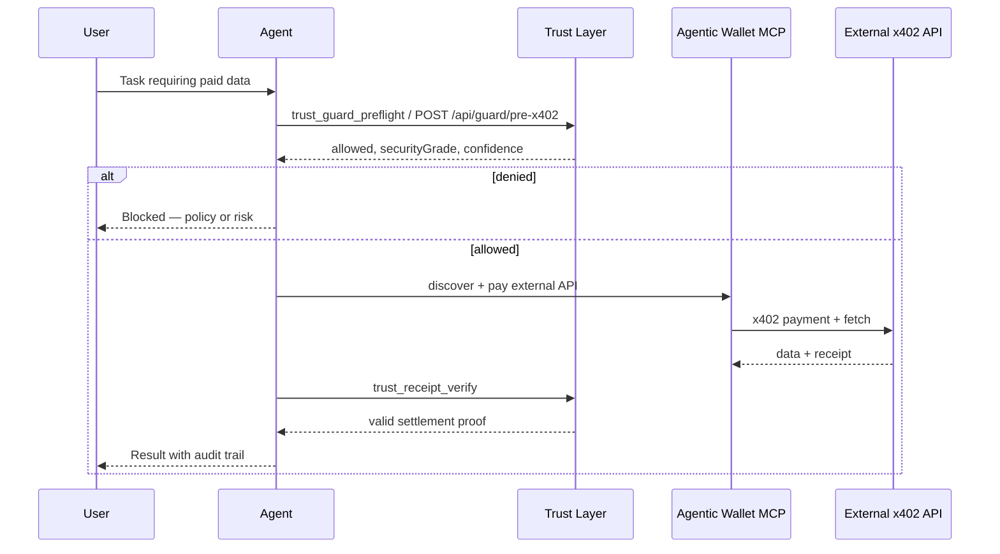

# Coinbase Agentic Wallet + x402 Trust Layer

**5-minute integration:** Guard every Agentic Wallet payment with Trust Layer preflight.

## Why combine them?

| Layer | Role |
|-------|------|
| [Agentic Wallet MCP](https://docs.cdp.coinbase.com/agentic-wallet/mcp/welcome) | Wallet, onramp, discover + pay x402 APIs |
| **x402 Trust Layer** | Decide *whether* to pay, trust score, audit trail |

> Coinbase Agentic Wallet **pays**. x402 Trust Layer **decides whether it should**.

## Setup

### 1. Agentic Wallet MCP

```bash
npx @coinbase/payments-mcp
```

Sign in with email OTP, add USDC via Coinbase Onramp, set spend limits in the wallet UI.

### 2. Trust Layer (no signup)

Base URL: `https://x402trustlayer.xyz` — pay per call in USDC (Base or Solana).

Optional npm helper:

```bash
npm install x402-agent-suite-preflight @dexterai/x402
```

### 3. MCP stack (recommended)

Add both MCP servers to your agent config:

```json
{
  "mcpServers": {
    "agentic-wallet": { "command": "npx", "args": ["-y", "@coinbase/payments-mcp"] },
    "trust-layer": { "command": "npx", "args": ["-y", "@x402trustlayer/mcp"] }
  }
}
```

Set `EVM_PRIVATE_KEY` for Trust Layer MCP (same wallet as Agentic Wallet if linked).

## Agent workflow



## Example: guard before pay

```json
POST https://x402trustlayer.xyz/api/guard/pre-x402
{
  "agentId": "my-agent-1",
  "walletAddress": "0xYourWallet",
  "targetUrl": "https://api.example.com/paid-endpoint",
  "estimatedCostUsdc": 0.05,
  "network": "eip155:8453",
  "policy": {
    "dailyCapUsdc": 10,
    "perCallCapUsdc": 1,
    "allowedHosts": ["api.example.com"]
  }
}
```

If `allowed` is false — **do not** call Agentic Wallet to pay.

## Enterprise flow

Add before guard:

1. `POST /api/mandate/compile` — signed intent from user
2. `POST /api/merchant-trust/score` — KYM on target host
3. `POST /api/mandate/verify` — scope check before each pay

After pay:

4. `POST /api/receipt-auditor/verify`
5. `POST /api/compliance/ledger`

## Fleet webhooks

Register deny alerts (beta, free):

```json
POST https://x402trustlayer.xyz/api/webhooks/register
{
  "fleetId": "my-fleet",
  "url": "https://your-backend/hooks/trust",
  "events": ["guard.denied", "receipt.invalid"]
}
```

## Cursor / Claude skill

```bash
npx skills add https://x402trustlayer.xyz
```

Loads `https://x402trustlayer.xyz/skill.md` into agent context.

## Links

- Trust Layer OpenAPI: https://x402trustlayer.xyz/openapi.json
- CDP Agentic Wallet docs: https://docs.cdp.coinbase.com/agentic-wallet/mcp/welcome
- Trust Layer MCP: `packages/trust-layer-mcp/README.md`
