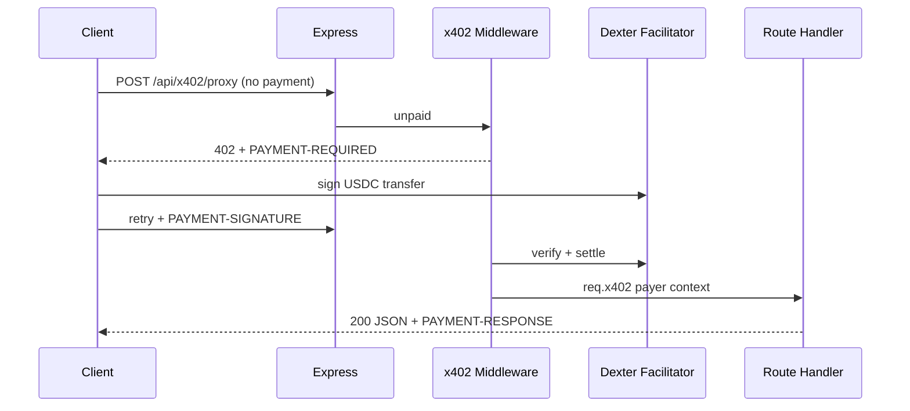

# Architecture

Production-grade x402 infrastructure API for AI agent fleets. **24 paid routes**, multi-chain (Base + Solana), Dexter facilitator settlement.

## Request flow



## Layout

```
src/
  index.ts           Express bootstrap, discovery, health
  routes.ts          Zod schemas + route wiring
  config.ts          Env + pricing table
  agents/            One module per paid capability
  lib/
    x402-paid.ts     Payment middleware + Bazaar extension
    ssrf.ts          Outbound URL policy
    attestation.ts   HMAC-signed preflight tokens
    probe.ts         Unpaid 402 discovery probes
    openapi-agentcash.ts  Marketplace OpenAPI
```

## Design choices

- **Paywall-first** — no business logic on unpaid `/api/*` (except verifier example body injection for marketplace probes).
- **Composable agents** — `pre-x402-guard`, `x402-proxy`, `pipeline/execute` share sub-agents; buy once per layer.
- **Discovery split** — OpenAPI lists paid ops only; free catalog at `GET /.well-known/x402`.
- **Persistence** — JSON files under `data/` (attestations, spend ledger, MPP). Replace with Postgres when fleet scale demands it.

## Extension points

| Integrator need | Entry route |
|-----------------|-------------|
| Pre-pay quote | `POST /api/market/buy-advisor` |
| Before downstream x402 | `POST /api/x402/proxy` or `POST /api/guard/pre-x402` |
| Full orchestration | `POST /api/pipeline/execute` |
| Seller QA | `POST /api/seller/audition-coach` |

See [INTEGRATE.md](./INTEGRATE.md) for client SDK usage.
