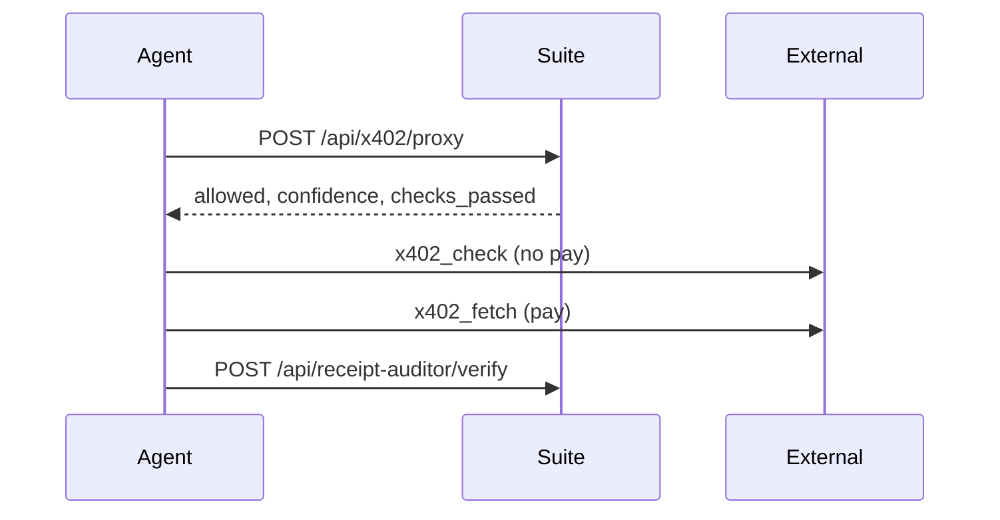

# Integrate x402 Agent Suite Pro

**Base:** `https://x402trustlayer.xyz`

## 3-line rule (other agents)

```text
1. POST /api/x402/proxy  (or /api/guard/pre-x402) — preflight
2. x402_check → x402_fetch on external URL
3. POST /api/receipt-auditor/verify — settlement proof
```

We do **not** guarantee 100% accuracy. Every paid response includes `confidence`, `checks_passed`, `sources`, and `accuracy_note`.

---

## Start here (buyers) — 3 entry points only

| Endpoint | Price | When |
|----------|-------|------|
| `POST /api/x402/proxy` | $0.08 | **Default** — one preflight before any external pay |
| `POST /api/guard/pre-x402` | $0.05 | Lighter bundle (same spend/identity/risk as proxy core) |
| `POST /api/pipeline/execute` | $0.25 | Multi-step orchestration + marketplace routing |

**Advanced (19 routes):** spend-governor, identity-gate, risk-gate, router, MPP, attestation, escrow, etc. — use when you need fine-grained control. Spend / identity / risk are **sub-steps inside guard**; call guard unless you need a single layer.

**Seller / discovery killers:**

| Endpoint | Price |
|----------|-------|
| `POST /api/market/buy-advisor` | $0.08 |
| `POST /api/seller/audition-coach` | $0.06 |

---

## Standard fleet flow



### TypeScript

```typescript
import { wrapFetch } from "@dexterai/x402/client";

// Solana: override Dexter default RPC if you see StructError on USDC mint (EPjFWdd5…)
// rpcUrls: { "solana:5eykt4UsFv8P8NJdTREpY1vzqKqZKvdp": process.env.SOLANA_RPC_URL ?? "https://api.mainnet-beta.solana.com" }

const BASE = "https://x402trustlayer.xyz";
const x402Fetch = wrapFetch(fetch, { evmPrivateKey: process.env.EVM_PRIVATE_KEY! });

const pre = await x402Fetch(`${BASE}/api/x402/proxy`, {
  method: "POST",
  headers: { "content-type": "application/json" },
  body: JSON.stringify({
    agentId: "my-agent-1",
    walletAddress: process.env.PAY_TO_ADDRESS,
    targetUrl: "https://downstream-x402-api.example/endpoint",
    estimatedCostUsdc: 0.05,
    policy: { dailyCapUsdc: 10, perCallCapUsdc: 1 },
    issueAttestation: true,
  }),
});
const gate = (await pre.json()) as { allowed: boolean; summary: string; confidence: number };
if (!gate.allowed) throw new Error(gate.summary);

// External: check price, then pay
// await x402_check(targetUrl); await x402_fetch(targetUrl);

await x402Fetch(`${BASE}/api/receipt-auditor/verify`, {
  method: "POST",
  headers: { "content-type": "application/json" },
  body: JSON.stringify({ network: "eip155:8453", expectedAmountUsdc: 0.05, /* settlement */ }),
});
```

---

## Attestation (partner agents)

1. `POST /api/attestation/issue` — after guard passes  
2. `POST /api/attestation/verify` — before downstream pay  
3. Optional header for partners: `X-Suite-Attestation: <attestationId>`  
4. `GET /api/attestation/registry` — fleet trust queries  

---

## npm helper

[`packages/x402-preflight`](../packages/x402-preflight/README.md) — wraps proxy/guard.

---

## Dexter / x402scan / Agentic

| Channel | Action |
|---------|--------|
| Dexter | `npm run demo` → [seller profile](https://dexter.cash/sellers/9c7tE587KpGYBjiNQrjw3nGvxQHhSYKU4Ba6WRgQsHkt) → **Verify Now** |
| x402scan | [Register server](https://www.x402scan.com/resources/register) — **31 paid URLs only, never /health** |
| Agentic | [AGENTIC-MARKET.md](./AGENTIC-MARKET.md) — validate HTTPS URLs, Base first |
| Agentic Wallet | [AGENTIC-WALLET.md](./AGENTIC-WALLET.md) — preflight before `@coinbase/payments-mcp` |
| MCP | `npx @x402trustlayer/mcp` — 5 core trust tools |
| AI agents | `npx skills add https://x402trustlayer.xyz` → `/skill.md` |
| Testnet | [TESTNET.md](./TESTNET.md) — `X402_TESTNET=1` + Base Sepolia |

See [MARKETPLACES.md](./MARKETPLACES.md) and [DEXTER-SCORE.md](./DEXTER-SCORE.md).
